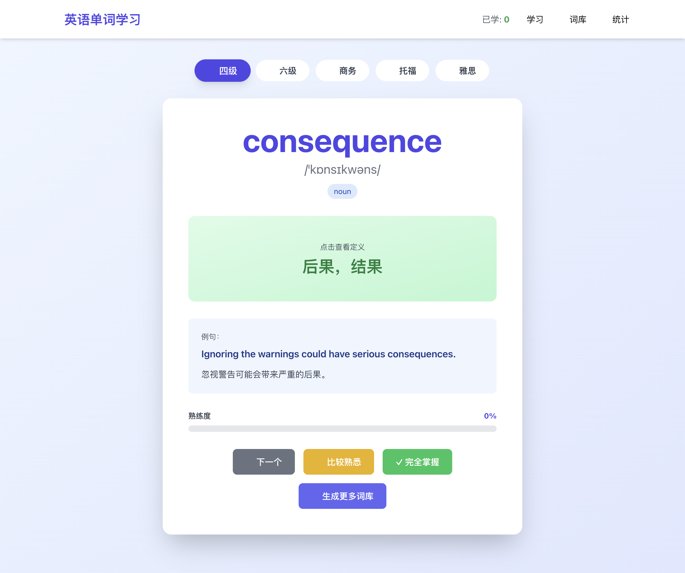
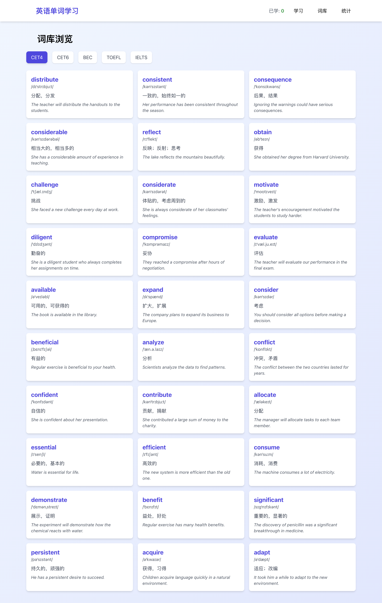
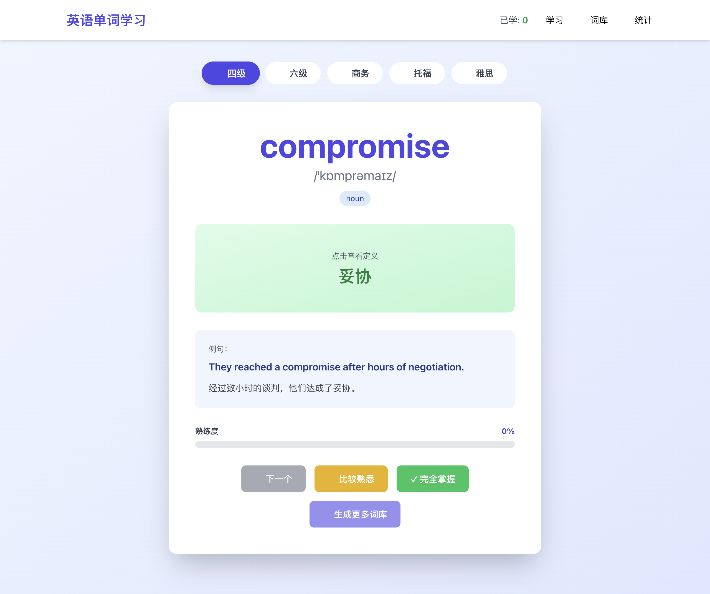
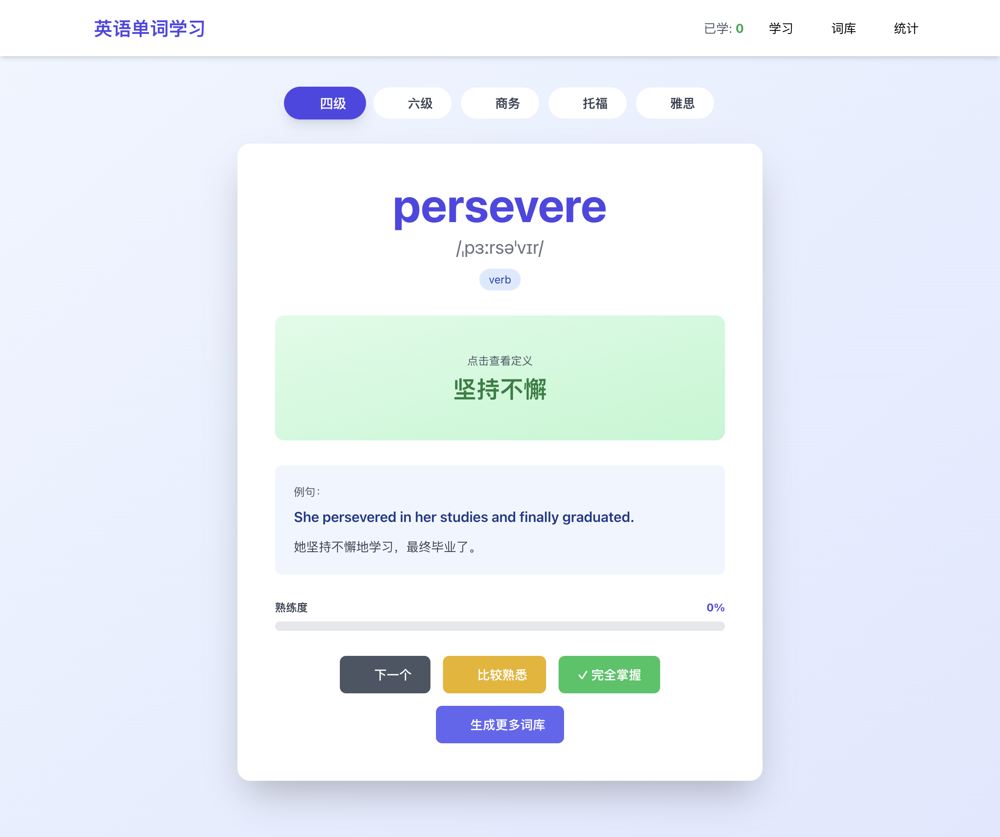

# 📚 English Words App — AI 英语单词学习系统

一个基于 **Vue3 + FastAPI + DeepSeek-V3** 的全栈单词学习应用。通过大模型按难度（四级/六级/商务/托福/雅思）**动态生成词库**，配合翻卡学习、熟练度标记与学习统计，形成「学 → 记 → 测 → 查」的完整学习闭环。



## ✨ 功能特性

- **AI 动态词库**：接入 DeepSeek-V3（SiliconFlow），按 5 个考试难度实时生成新词，自动**累计入库并去重**
- **学习闭环**：随机出词 → 点击翻卡查看英文定义 → 标记「比较熟悉 / 完全掌握」→ 熟练度进度条实时反馈
- **智能出词策略**：优先抽未学过的词 → 再复习未完全掌握的 → 全部掌握才随机，且不会连续抽到同一词
- **词库浏览**：按难度标签切换，卡片式浏览单词音标/释义/例句
- **学习统计**：五难度词库分布、总词数、学习进度一目了然
- **容错降级**：未配置 API Key 或 AI 调用失败时自动回退备用词库，服务永不中断

## 🛠 技术栈

| 端 | 技术 |
|----|------|
| 前端 | Vue 3 · Vite · Pinia · Vue Router · TailwindCSS · Axios |
| 后端 | FastAPI · SQLAlchemy · Pydantic · Uvicorn |
| 数据库 | SQLite |
| AI | DeepSeek-V3（经 SiliconFlow，OpenAI 协议） |

## 📁 项目结构

```
English-words-app/
├── backend/                    # FastAPI 后端
│   ├── app/
│   │   ├── main.py             # 应用入口 + API 路由
│   │   ├── database.py         # SQLite 连接
│   │   ├── models.py           # ORM 模型（words / learning_records）
│   │   ├── schemas.py          # Pydantic 数据模型
│   │   ├── seeds.py            # 五难度种子单词
│   │   └── services/
│   │       ├── ai_service.py   # DeepSeek-V3 单词生成器（含备用词库）
│   │       └── word_service.py # 业务逻辑（取词/学习记录/统计）
│   └── requirements.txt
└── frontend/                   # Vue3 前端
    └── src/
        ├── api/client.js       # Axios 封装
        ├── stores/wordStore.js # Pinia 全局状态
        └── components/         # 学习/词库/统计三个页面
```

## 🚀 快速开始

### 1. 启动后端

```bash
cd backend
python -m venv venv && source venv/bin/activate
pip install -r requirements.txt

# 配置环境变量（可选，不配也能跑，AI 生成走备用词库）
cp .env.example .env   # 填入你的 Key 后
# 或直接：
export OPENAI_API_KEY=sk-xxx
export OPENAI_MODEL=deepseek-ai/DeepSeek-V3
export OPENAI_BASE_URL=https://api.siliconflow.cn/v1

python -m uvicorn app.main:app --host 0.0.0.0 --port 8000
```

> 首次启动自动建表；如需种子词执行 `python app/seeds.py`。接口文档见 http://localhost:8000/docs

### 2. 启动前端

```bash
cd frontend
npm install
npm run dev        # 开发模式 → http://localhost:5173
npm run build      # 生产构建
```

## 🔌 API 一览

| 方法 | 路径 | 说明 |
|------|------|------|
| POST | `/api/words/generate` | AI 生成词库（累计去重），参数 `difficulty`、`count` |
| GET | `/api/words` | 获取词库列表，参数 `difficulty`、`skip`、`limit` |
| GET | `/api/study/random` | 随机取词，参数 `difficulty`、`exclude_id`（排除刚看过的词） |
| POST | `/api/study/record` | 记录学习进度（熟练度） |
| GET | `/api/stats` | 学习统计（总词数/分难度词数） |
| GET | `/api/health` | 健康检查 |

### 随机取词的三级优先策略

```python
# 1. 从未学过（无学习记录）
# 2. 学过但未完全掌握（proficiency < 100）
# 3. 兜底：当前难度全部单词
```

## 🗄 数据库设计

**words 词库表**：`word` 字段带唯一索引，配合服务层查重，保证 AI 生成的词库「累计且不重复」。

**learning_records 学习记录表**：按 `word_id` 记录学习次数与熟练度（0-100），支撑进度条与统计页。

## 🖼 界面预览

| 学习页 | 词库页 | 统计页 |
|--------|--------|--------|
|  |  |  |

AI 生成词库（点击「生成更多词库」按钮，生成中 → 完成后自动刷新）：

| 生成中 | 生成完成 |
|--------|----------|
|  |  |

## 📌 注意事项

- `backend/.env` 存放 API Key，已被 `.gitignore` 忽略，**严禁提交到仓库**
- AI 生成 20 个词约需 30-60 秒（逐词调用大模型），期间前端按钮为加载态

## 📄 License

MIT
